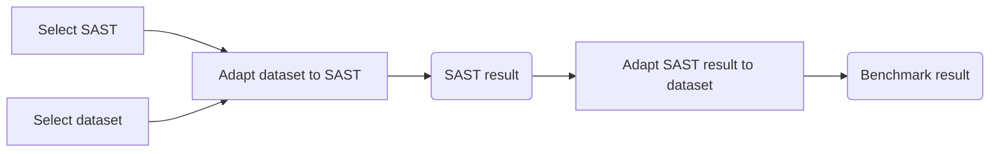

# SAST Benchmark

A collection of scripts and wrappers around SASTs and datasets for benchmarking and project testing purposes.

## Available SASTs and Datasets

|SASTs|Datasets|Language|Results|
|:---:|:---:|:---:|:---:|
|Coverity|CVEfixes|Java|[Figures](./results/Coverity/CVEfixes/_figures/)|

## Benchmark workflow

SAST results need to be transformed to a common format to be used by the dataset `stats` script:
- Result (Predicted) is a **list of defects/warnings/messages** that has AT LEAST these attributes:
  - `cwe_id`: CWE associated with the defect/warning/message
  - `file`: Source file having the associated weakness
- Dataset value (Actual) should AT LEAST contain:
  - `cwe_ids`: all CWEs of the vulnerable code
  - `file(s)`: file(s) having the associated weakness

More criteria can be added for a more precise analysis (function name, line number).
