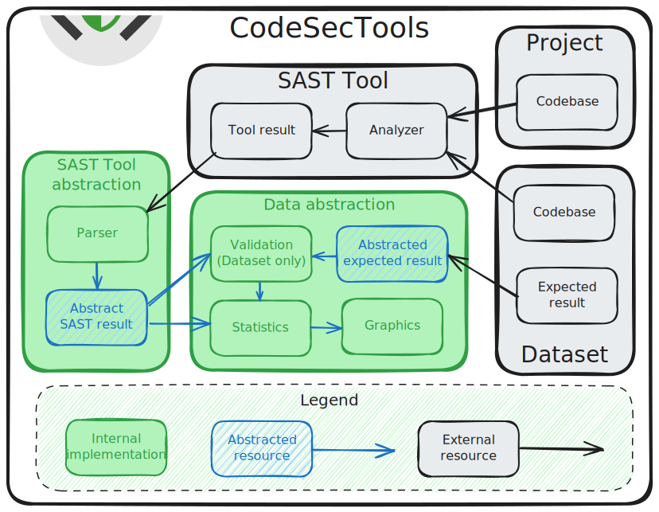

# CodeSecTools

<div align="center">
  
</div>

A framework for code security that provides abstractions for static analysis tools and datasets to support their integration, testing, and evaluation.

## Overview

**CodeSecTools** is a collection of scripts and wrappers that abstract external resources (such as SAST tools, datasets, and codebases), providing standardized interfaces to help them interact easily.

<div align="center">
  
</div>

> [!WARNING]
> This project provides wrappers and scripts to integrate with various third-party static analysis security testing (SAST) tools and datasets. It is important to note that this project **does not include** these third-party tools or datasets, unless otherwise specified. When a tool or dataset is included, its associated license file is also provided.
> 
> Users of this project are solely responsible for reviewing, understanding, and complying with the licenses and terms of use associated with any third-party tools or datasets they choose to use through this framework. The respective licenses and terms can be found on the official websites or in the documentation of each tool or dataset.


## Installation

- Clone the repository:
```bash
git clone https://github.com/OPPIDA/CodeSecTools.git
cd CodeSecTools
```

- Install the project:

    - Using [uv](https://github.com/astral-sh/uv):
      ```bash
      uv tool install .
      ```

    - Using [pipx](https://github.com/pypa/pipx):
      ```bash
      pipx install .
      ```

    - Using pip (not recommended, as it can break your system packages):
      ```bash
      pip install .
      ```

## Features

- **Standardized SAST Tool Integration**: Provides a common abstraction layer for integrating various SAST tools. Once a tool is integrated, it automatically benefits from the framework’s core functionalities.
- **Unified Dataset Integration**: Uses a similar abstraction for handling datasets, allowing for consistent benchmarking of SAST tools across different sets of codebases, whether they are collections of individual files or entire Git repositories.
- **Project Analysis and Benchmarking**: Users can analyze their own projects or benchmark SAST tools against curated datasets to evaluate their effectiveness, including metrics like true positives, false positives, and false negatives.
- **Concurrent Analysis for Cross-Verification**: CodeSecTools can run multiple SAST tools simultaneously on the same project. This allows for the aggregation and cross-verification of results, increasing confidence in the identified vulnerabilities by highlighting findings reported by multiple tools.
- **Automated Reporting and Visualization**: The framework can generate detailed reports in HTML format and create graphs to visualize analysis results, helping to identify trends such as the most common CWEs or the files with the highest number of defects.

### SAST Tool Integration Status

|SAST Tool|Languages|Maintained|Continuous Testing|Last Test Date|
|:---:|:---:|:---:|:---:|:---:|
|Coverity|Java|❌<br>(Proprietary)|❌<br>(Proprietary)|October 2025|
|Semgrep Community Edition|C/C++, Java|✅|✅|[Latest PR](https://github.com/OPPIDA/CodeSecTools/actions/workflows/ci.yaml)|
|Snyk Code|C/C++, Java|✅|❌<br>(Rate limited)|November 2025|
|Bearer|Java|✅|✅|[Latest PR](https://github.com/OPPIDA/CodeSecTools/actions/workflows/ci.yaml)|
|SpotBugs|Java|✅|✅|[Latest PR](https://github.com/OPPIDA/CodeSecTools/actions/workflows/ci.yaml)|
|Cppcheck|C/C++|✅|✅|[Latest PR](https://github.com/OPPIDA/CodeSecTools/actions/workflows/ci.yaml)|

## Usage

#### Command-line interface

```bash
$ cstools
                                                                                                                                                   
 Usage: cstools [OPTIONS] COMMAND [ARGS]...                                                                                                        
                                                                                                                                                   
 CodeSecTools: A framework for code security that provides abstractions for static analysis tools and datasets to support their integration,       
 testing, and evaluation.                                                                                                                          
                                                                                                                                                   
╭─ Options ───────────────────────────────────────────────────────────────────────────────────────────────────────────────────────────────────────╮
│ --debug               -d        Show debugging messages and disable pretty exceptions.                                                          │
│ --version             -v        Show the tool's version.                                                                                        │
│ --install-completion            Install completion for the current shell.                                                                       │
│ --show-completion               Show completion for the current shell, to copy it or customize the installation.                                │
│ --help                          Show this message and exit.                                                                                     │
╰─────────────────────────────────────────────────────────────────────────────────────────────────────────────────────────────────────────────────╯
╭─ Commands ──────────────────────────────────────────────────────────────────────────────────────────────────────────────────────────────────────╮
│ status      Display the availability of SAST tools and datasets.                                                                                │
│ allsast     Run all available SAST tools together.                                                                                              │
│ bearer      Bearer SAST                                                                                                                         │
│ coverity    Coverity Static Analysis                                                                                                            │
│ semgrepce   Semgrep Community Edition Engine                                                                                                    │
│ snykcode    Snyk Code                                                                                                                           │
│ spotbugs    SpotBugs                                                                                                                            │
╰─────────────────────────────────────────────────────────────────────────────────────────────────────────────────────────────────────────────────╯
```

#### Python API

```python
from pathlib import Path

from codesectools.sasts.core.graphics import ProjectGraphics
from codesectools.sasts.tools.SemgrepCE.parser import SemgrepCEAnalysisResult
from codesectools.sasts.tools.SemgrepCE.sast import SemgrepCESAST

project_dir = Path("path/to/project")
output_dir = Path("path/to/project")

# Run SAST Tool
sast = SemgrepCESAST()
sast.run_analysis(lang="java", project_dir=project_dir, output_dir=output_dir)

# Parse results
parser = SemgrepCEAnalysisResult.load_from_output_dir(output_dir=output_dir)
print(parser.stats_by_categories())
print(parser.stats_by_checkers())
print(parser.stats_by_cwes())
print(parser.stats_by_files())

# Visualize results
graphics = ProjectGraphics(sast=sast, project_name=project_dir.name)
for plot_function in graphics.plot_functions:
    fig = plot_function()
    fig.show()
```

## Documentation

The documentation is available [online](https://oppida.github.io/CodeSecTools/).

Or, you can serve it locally:
```bash
pip install .[docs]
mkdocs serve
```