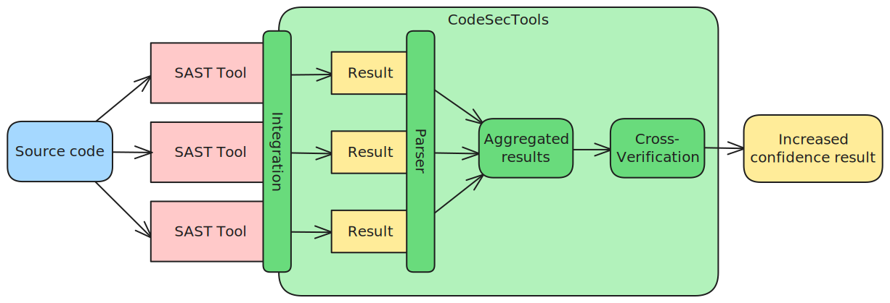
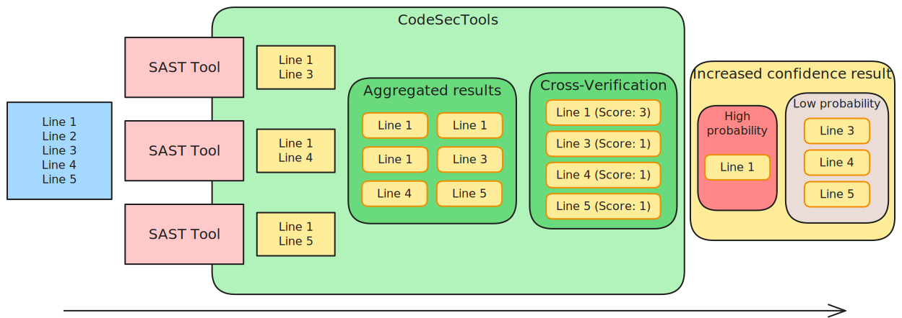
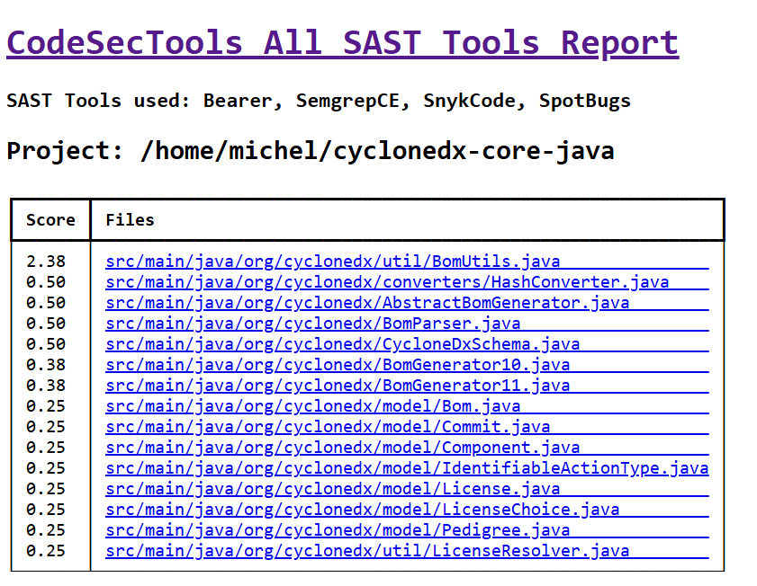
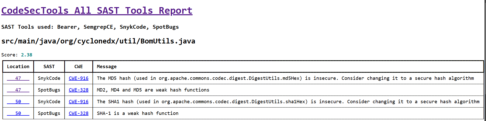
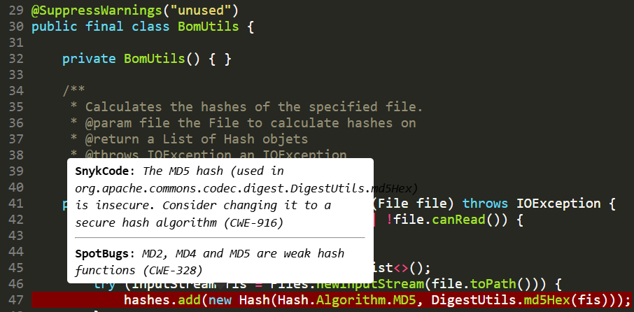
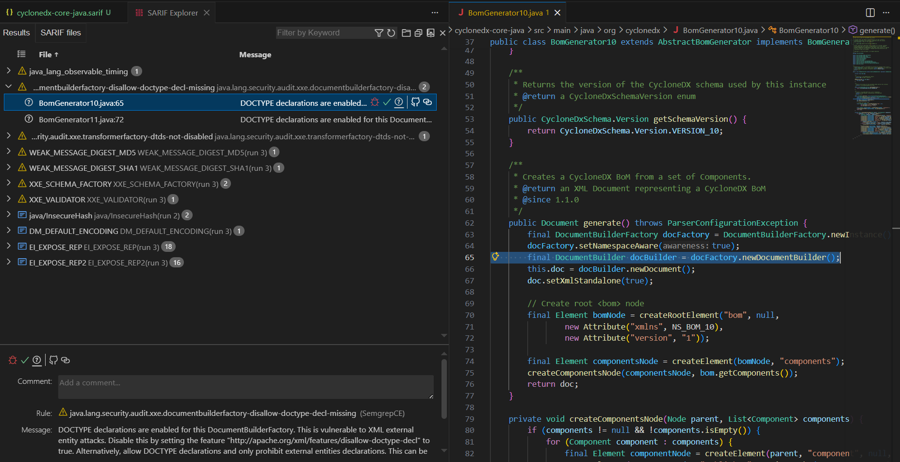
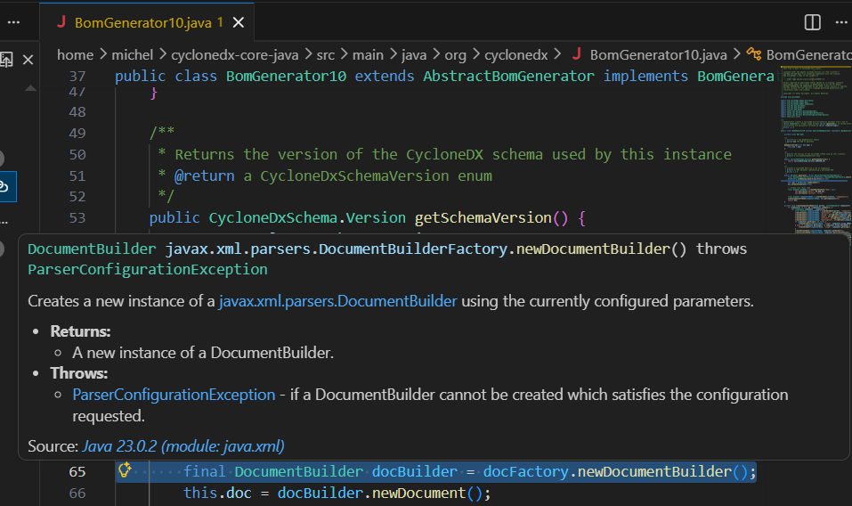

<!--start-include-->
# CodeSecTools <!-- omit in toc -->

<div align="center">
  
</div>

A framework for code security that provides abstractions for static analysis tools and datasets to support their integration, testing, and evaluation.

> [!WARNING]
> This project is under active development. New versions may introduce breaking changes that can affect existing configurations or previously generated results. Use with caution.
<!--end-include-->

## Table Of Contents <!-- omit in toc -->
- [Overview](#overview)
- [Features](#features)
- [SAST Tool Integration Status](#sast-tool-integration-status)
- [Usage](#usage)
  - [Running the Tool](#running-the-tool)
    - [Command-line interface](#command-line-interface)
    - [Docker](#docker)
    - [Python API](#python-api)
  - [Report generation](#report-generation)
    - [HTML](#html)
    - [SARIF](#sarif)

<!--start-include-->
## Overview

**CodeSecTools** is a collection of scripts and wrappers that abstract external resources (such as SAST tools, datasets, and codebases), providing standardized interfaces to help them interact easily.

<div align="center">
  
  
</div>

For step-by-step instructions on installation, configuration, and basic usage, please refer to the [**quick start guide**](https://oppida.github.io/CodeSecTools/home/quick_start_guide.html).

For more details on the design and integration of SAST tools and datasets in CodeSecTools, please refer to the [documentation](https://oppida.github.io/CodeSecTools). 

## Features

- **Standardized SAST Tool Integration**: Provides a common abstraction layer for integrating various SAST tools. Once a tool is integrated, it automatically benefits from the framework’s core functionalities.
- **Unified Dataset Integration**: Uses a similar abstraction for handling datasets, allowing for consistent benchmarking of SAST tools across different sets of codebases, whether they are collections of individual files or entire Git repositories.
- **Project Analysis and Benchmarking**: Users can analyze their own projects or benchmark SAST tools against curated datasets to evaluate their effectiveness, including metrics like true positives, false positives, and false negatives.
- **Concurrent Analysis for Cross-Verification**: CodeSecTools can run multiple SAST tools simultaneously on the same project. This allows for the aggregation and cross-verification of results, increasing confidence in the identified vulnerabilities by highlighting findings reported by multiple tools.
- **Automated Reporting and Visualization**: The framework can generate detailed reports in HTML format and create graphs to visualize analysis results, helping to identify trends such as the most common CWEs or the files with the highest number of defects.

> [!WARNING]
> This project provides wrappers and scripts to integrate with various third-party static analysis security testing (SAST) tools and datasets. By default, this project **does not include third-party tools or datasets**. In the few instances where they are included, their associated license files are provided.
> 
> Users of this project are solely responsible for reviewing, understanding, and complying with the licenses and terms of use associated with any third-party tools or datasets they choose to use through this framework. The respective licenses and terms can be found on the official websites or in the documentation of each tool or dataset.

## SAST Tool Integration Status

|SAST Tool|Languages|Maintained|Included in Docker|Continuous Testing|Last Test Date|
|:---:|:---:|:---:|:---:|:---:|:---:|
|Coverity|C/C++, Java|✅|❌|❌<br>(Proprietary)|February 2026|
|Semgrep Community Edition|C/C++, Java|✅|✅|✅|[Latest PR](https://github.com/OPPIDA/CodeSecTools/actions/workflows/ci.yaml)|
|Snyk Code|C/C++, Java|✅|❌|❌<br>(Rate limited)|February 2026|
|Bearer|Java|✅|✅|✅|[Latest PR](https://github.com/OPPIDA/CodeSecTools/actions/workflows/ci.yaml)|
|SpotBugs|Java|✅|✅|✅|[Latest PR](https://github.com/OPPIDA/CodeSecTools/actions/workflows/ci.yaml)|
|Cppcheck|C/C++|✅|✅|✅|[Latest PR](https://github.com/OPPIDA/CodeSecTools/actions/workflows/ci.yaml)|

Languages supported by the SAST tool are also available, but they are not actively maintained (some features are disabled).

## Usage

### Running the Tool

#### Command-line interface

```bash
cstools

 Usage: cstools [OPTIONS] COMMAND [ARGS]...                                     
                                                                                
 CodeSecTools CLI.                                                              
                                                                                
╭─ Options ────────────────────────────────────────────────────────────────────╮
│ --debug    -d        Show debugging messages and disable pretty exceptions.  │
│ --version  -v        Show the tool's version.                                │
╰──────────────────────────────────────────────────────────────────────────────╯
╭─ Commands ───────────────────────────────────────────────────────────────────╮
│ status     Display the availability of SAST tools and datasets.              │
│ docker     Start the Docker environment for the specified target (current    │
│            directory by default).                                            │
│ allsast    Run all available SAST tools together.                            │
│ bearer     Bearer SAST                                                       │
│ coverity   Coverity Static Analysis                                          │
│ cppcheck   Cppcheck                                                          │
│ semgrepce  Semgrep Community Edition Engine                                  │
│ snykcode   Snyk Code                                                         │
│ spotbugs   SpotBugs                                                          │
╰──────────────────────────────────────────────────────────────────────────────╯
```

#### Docker

A Docker image is available with only free and offline SAST tools pre-installed.

```bash
UID=$(id -u) GID=$(id -g) docker compose build main
docker run -it -v $HOME/.codesectools:/home/codesectools/.codesectools codesectools /bin/bash
```

Mount necessary directories if you want to include:

- a target (`-v ./myproject:/home/codesectools/myproject`)
- existing CodeSecTools data (`-v $HOME/.codesectools:/home/codesectools/.codesectools`) 

A simpler way is to use the CLI:

```bash
cstools docker --help
                                                                                
 Usage: cstools docker [OPTIONS]                                                
                                                                                
 Start the Docker environment for the specified target (current directory by    
 default).                                                                      
                                                                                
╭─ Options ────────────────────────────────────────────────────────────────────╮
│ --target                         PATH  The directory to mount inside the     │
│                                        container.                            │
│                                        [default: .]                          │
│ --isolation    --no-isolation          Enable network isolation for the      │
│                                        container (disables host network      │
│                                        sharing).                             │
│                                        [default: no-isolation]               │
│ --help                                 Show this message and exit.           │
╰──────────────────────────────────────────────────────────────────────────────╯
```

#### Python API

```python
from pathlib import Path

from codesectools.sasts.core.graphics import ProjectGraphics
from codesectools.sasts.tools.SemgrepCE.parser import SemgrepCEAnalysisResult
from codesectools.sasts.tools.SemgrepCE.sast import SemgrepCESAST

project_dir = Path("path/to/project")
output_dir = Path("path/to/project")

# Run SAST Tool
sast = SemgrepCESAST()
sast.run_analysis(lang="java", project_dir=project_dir, output_dir=output_dir)

# Parse results
parser = SemgrepCEAnalysisResult.load_from_output_dir(output_dir=output_dir)
print(parser.stats_by_categories())
print(parser.stats_by_checkers())
print(parser.stats_by_cwes())
print(parser.stats_by_files())

# Visualize results
graphics = ProjectGraphics(sast=sast, project_name=project_dir.name)
for plot_function in graphics.plot_functions:
    fig = plot_function()
    fig.show()
```

### Report generation

CodeSecTools can generate reports when running with `allsast`:
```bash
cstools allsast report --help

 Usage: cstools allsast report [OPTIONS] PROJECT                                
                                                                                
 Generate an HTML report                                                        
                                                                                
╭─ Arguments ──────────────────────────────────────────────────────────────────╮
│ *    project      CHOICE  [required]                                         │
╰──────────────────────────────────────────────────────────────────────────────╯
╭─ Options ────────────────────────────────────────────────────────────────────╮
│ --format           [HTML|SARIF]  Report format [default: HTML]               │
│ --top              INTEGER       Limit to a number of files by score         │
│ --overwrite                      Overwrite existing results                  │
│ --help                           Show this message and exit.                 │
╰──────────────────────────────────────────────────────────────────────────────╯
```

Each report format provides different information and may require additional tools.

#### HTML

Low requirements. Good for visualization and getting a quick overview.

- Requirements: 
  - A web browser with JavaScript enabled
- Pros:
  - Source files are **sorted** by score
  - Source files are **included** and displayed in the report
  - Findings are **highlighted** and SAST tools messages are shown on hover
- Cons:
  - No navigation between source files
  - Intended for visualization only
  - Not suitable for advanced code analysis

| *Report* | *Finding* | *Hover* |
|:---:|:---:|:---:|
|  |  |  |

#### SARIF

Higher requirements. Best suited for advanced code analysis and triage.

- Requirements:
  - VSCode with:
    - [vscode-sarif-explorer](https://github.com/trailofbits/vscode-sarif-explorer) extension
    - Language Server Extension:
      - C/C++: [vscode-clangd](https://github.com/clangd/vscode-clangd)
      - Java: [vscode-java](https://github.com/redhat-developer/vscode-java)
  - Source code
- Features:
  - Triage interface with `vscode-sarif-explorer`:
    - Filter findings:
      - by keywords
      - by path (include/exclude)
      - by level (error, warning, note, none)
    - Navigate directly to the source code
    - Mark findings as true or false positives
    - Add comments to findings
    - For more details, see [vscode-sarif-explorer](https://github.com/trailofbits/vscode-sarif-explorer)
  - Advanced code analysis with Language Server:
    - Go to definition
    - Find references
    - View documentation
    - And more...

| *Triage* | *Documentation* |
|:---:|:---:|
|  |  |
<!--end-include-->