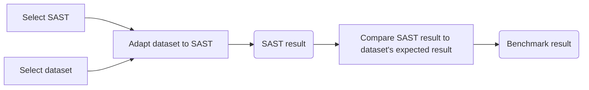

# SAST Benchmark

A collection of scripts and wrappers around SASTs and datasets for benchmarking and project testing purposes.

## Available SASTs and Datasets

|**SASTs**|**Datasets**|**Language**|**Stored results**|
|:---:|:---:|:---:|:---:|
|[`Coverity`](/SASTs/README.md#1-coverity-static-analysis)|[`CVEfixes`](/datasets/README.md#1-cvefixes)|Java|✅[View Results](./results/Coverity/CVEfixes/README.md)|
|[`Coverity`](/SASTs/README.md#1-coverity-static-analysis)|[`SemgrepTest`](/datasets/README.md#2-semgrep-test-code)|Java|✅[View Results](./results/Coverity/SemgrepTest/README.md)|
|[`Coverity`](/SASTs/README.md#1-coverity-static-analysis)|[`BenchmarkJava`](/datasets/README.md#3-benchmarkjava)|Java|✅[View Results](./results/Coverity/BenchmarkJava/README.md)|
|[`Semgrep`](/SASTs/README.md#2-semgrep-pro-engine)|[`BenchmarkJava`](/datasets/README.md#3-benchmarkjava)|Java|✅[View Results](./results/Semgrep/BenchmarkJava/README.md)|

## Getting started

- Install the [uv](https://github.com/astral-sh/uv) package and project manager:
  ```bash
  pip install uv
  ```

- Set up a virtual environment and install the project dependencies:
  ```bash
  uv sync
  ```

- Make the script executable and run it from any directory:
  ```bash
  chmod +x sastb
  ./sastb
  ```

- Add the project directory to your `PATH` to run the script from anywhere:
  ```bash
  # Bash
  echo "export PATH=\$PATH:$(pwd)" >> ~/.bashrc
  source ~/.bashrc

  # Zsh
  echo "export PATH=\$PATH:$(pwd)" >> ~/.zshrc
  source ~/.zshrc

  # Fish Shell
  fish_add_path (pwd)
  ```

## Benchmark workflow



SAST results need to be transformed to a common format to be used by the dataset `stats` script:
- Result (Predicted) is a **list of defects/warnings/messages** that has AT LEAST these attributes:
  - `cwe_id`: CWE associated with the defect/warning/message
  - `file`: Source file having the associated weakness
- Dataset value (Actual) should AT LEAST contain:
  - `cwe_ids`: all CWEs of the vulnerable code
  - `filename(s)`: file(s) having the associated weakness

More criteria can be added for a more precise analysis (function name, line number).
