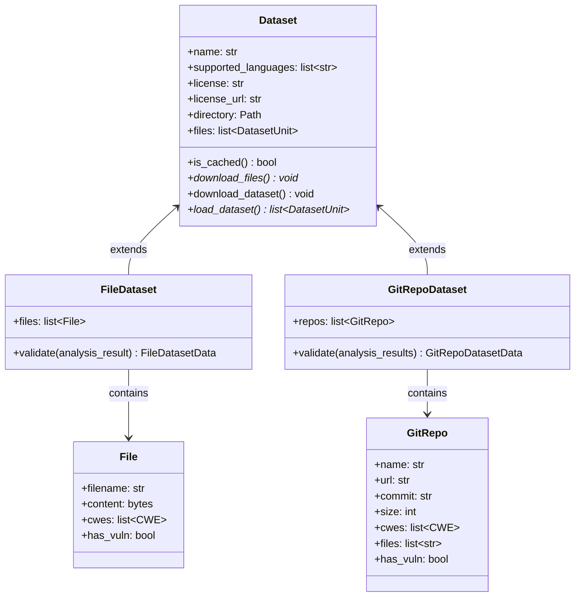

# Dataset

A dataset in CodeSecTools is a collection of code samples used to benchmark and evaluate the performance of SAST tools. Each dataset contains a **"ground truth,"** which specifies which code samples contain vulnerabilities and which do not, along with the corresponding **Common Weakness Enumeration (CWE) IDs**.

## Types

CodeSecTools supports two main types of datasets:

- `FileDataset`: A collection of **individual source code files**. Each file is a self-contained test case, which is useful for testing specific, isolated code patterns.
- `GitRepoDataset`: A collection of **Git repositories**, each checked out to a specific commit. This type is ideal for representing real-world vulnerabilities in the context of a larger project.

## Core Components

The framework provides a set of core abstract classes to standardize dataset integrations. The main components are `Dataset`, `FileDataset`, `GitRepoDataset`, `File`, and `GitRepo`.

## Integration

To integrate a new dataset into CodeSecTools, you need to create one main script:

- `dataset.py`: Defines the dataset's metadata (name, supported languages, license), provides the logic for downloading the dataset files, and implements the logic to load the code samples and their ground truth.

Once this script is added to a new subdirectory within `codesectools/datasets/`, the dataset is automatically discovered and integrated into the framework.

### Requirements
A dataset must meet the following requirements to be integrated:

- It must have a **clearly defined ground truth**, specifying which code units (files or repository commits) are vulnerable and which are not.
- For vulnerable units, the associated **CWE(s) must be provided**.
- The dataset must have a license, and the **license information (name and URL) must be provided**.

### Example

Please refer to existing dataset implementations for an example.
