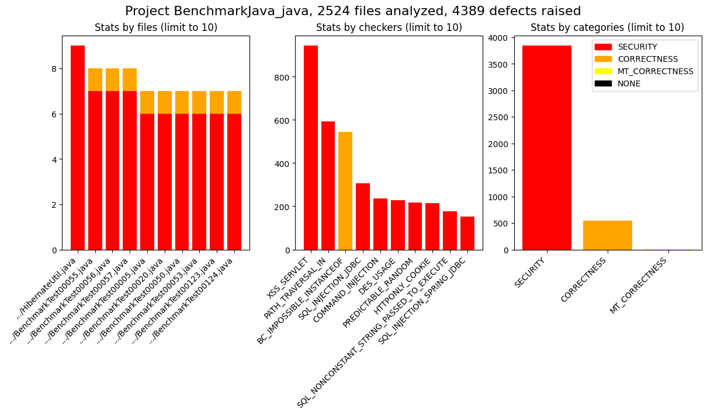
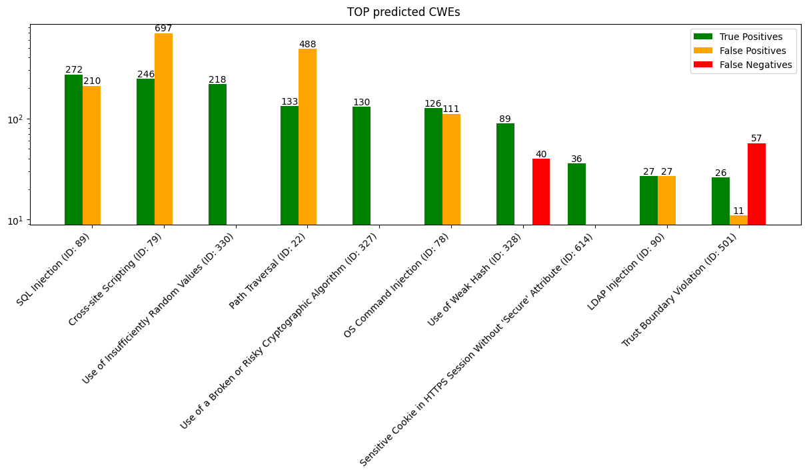

# Quick Start Guide

In this section, you will learn how to use CodeSecTools.

This guide mainly used the tool on Java projects, it is perfectly possible to run it on any project that language is supported.

## 1. Prerequisites

For this guide, there are two ways to install the tool:

!!! cube "Local installation"
    - You will need to install the following packages:

        - `git`
        - `cloc`
        - Java Development Kit (17)
        - `maven`

    - And the following SAST tools:

        - [Bearer](/sast/supported/bearer.j2.html){:target="_blank"}
        - [Semgrep Community Edition](/sast/supported/semgrepce.j2.html){:target="_blank"}
        - [SpotBugs](/sast/supported/spotbugs.j2.html){:target="_blank"}

!!! docker "Docker image"
    A Docker image is available with the prerequisites installed.
    You can use it to run CodeSecTools without installing extra packages on your system.


## 2. Installation

!!! cube "Normal installation"

    - Clone the repository:
    ```bash
    git clone https://github.com/OPPIDA/CodeSecTools.git
    cd CodeSecTools
    ```

      - Install the project:

        - Using [uv](https://github.com/astral-sh/uv):
          ```bash
          uv tool install .
          ```

        - Using [pipx](https://github.com/pypa/pipx):
          ```bash
          pipx install .
          ```

        - Using pip (not recommended, as it can break your system packages):
          ```bash
          pip install .
          ```

!!! docker "Docker image"
    Create a new directory which will be mounted in the docker container and start the container:
    ```bash
    mkdir codesectools_quick_start_guide
    cd codesectools_quick_start_guide
    cstools docker
    ```

    Then inside the container:
    ```bash
    cd codesectools_quick_start_guide
    ```

    Only data inside `./codesectools_quick_start_guide` are saved.


## 3. First run

!!! abstract  "Install completion (optional)"
    *Completion is already installed in the Docker container.*
    
    ```bash
    cstools --install-completion 
    # For bash
    source ~/.bash_completions/cstools.sh
    ```

!!! abstract "Download external resources"
    This command downloads datasets, rules, and plugins required for the SAST tools.

    For each external resource, you will be prompted with resource information and, most importantly, its license/term.
    ```bash
    cstools download all
    ```

!!! abstract "Check the integration status"
    This command allows you to check if a SAST tool or dataset is available.

    If not, it will specify what is missing.
    ```bash
    cstools status
    ```

    For this guide, the status for Bearer, SemgrepCE, and SpotBugs should be `Full ✅`.

## 4. Common Use Cases

### Analysis with multiple SAST tools

One important feature of CodeSecTools is the ability to run **multiple** SAST tools in order to:

- **aggregate** all the results to take advantage of each SAST tool's strengths (detecting specific vulnerabilities);
- **cross-verify** results and increase the confidence that a finding is a true positive.

Here are some analyses running CodeSecTools on vulnerable projects:

??? scan "cyclonedx-core-java (CVE-2025-64518)"
    *Vulnerability details are from [Github Advisory](https://github.com/advisories/GHSA-6fhj-vr9j-g45r).*

    - Weakness: [CWE-611](https://cwe.mitre.org/data/definitions/611.html) (Improper Restriction of XML External Entity Reference).
    - Introduced in commit [162aa59](https://github.com/CycloneDX/cyclonedx-core-java/commit/162aa594f347b3f612fe0a45071693c3cd398ce9#diff-fc28290f55c35403fc95b45ee2714337621f54b48caba5e01f08d5760b54139a).
    - Patched in pull request [#737](https://github.com/CycloneDX/cyclonedx-core-java/pull/737/files#diff-fc28290f55c35403fc95b45ee2714337621f54b48caba5e01f08d5760b54139a).
    - Vulnerable file: [`src/main/java/org/cyclonedx/CycloneDxSchema.java`](https://github.com/CycloneDX/cyclonedx-core-java/commit/162aa594f347b3f612fe0a45071693c3cd398ce9#diff-fc28290f55c35403fc95b45ee2714337621f54b48caba5e01f08d5760b54139a).

    Download the vulnerable version of the project:
    ```bash
    git clone https://github.com/CycloneDX/cyclonedx-core-java
    cd cyclonedx-core-java
    git checkout 162aa59
    ```

    Compile the project to generate Java bytecode for SAST tools that require it:
    ```bash
    mvn clean compile
    ```

    Run analysis with all SAST tools:
    ```bash
    cstools allsast analyze java --artifacts target/classes/
    ```

    Generate figures and report:
    ```bash
    cstools allsast plot cyclonedx-core-java
    cstools allsast report cyclonedx-core-java
    ```

    Open the project report (`~/.codesectools/output/AllSAST/cyclonedx-core-java/report/home.html`). 

    The report of the vulnerable file is shown here:

    <iframe width="100%" height="500" style="zoom: 0.5;" src="quick_start_guide/cyclonedx-core-java/report.html"></iframe>

    Some issues have been found by the tools in the vulnerable file, and the file is ranked high (high score) overall among all other files where issues were found.

    SpotBugs is the only tool that detected issues and correctly identified the vulnerability (exact CWE ID).

??? scan "conductor (CVE-2025-26074)"
    *Vulnerability details are from [Github Advisory](https://github.com/advisories/GHSA-8gqp-hr9g-pg62).*

    - Weakness: [CWE-78](https://cwe.mitre.org/data/definitions/78.html) (Improper Neutralization of Special Elements used in an OS Command ('OS Command Injection')).
    - Patched in commit [e981650](https://github.com/conductor-oss/conductor/commit/e9816501df1e364a3d39d7fe37d6e167c40eaa1b).
    - Vulnerable file: [`core/src/main/java/com/netflix/conductor/core/events/ScriptEvaluator.java`](https://github.com/conductor-oss/conductor/blob/main/core/src/main/java/com/netflix/conductor/core/events/ScriptEvaluator.java).
    - *Note: the patch did not modify the vulnerable file but other files, which attenuated the vulnerability.*

    Download the vulnerable version of the project:
    ```bash
    git clone https://github.com/conductor-oss/conductor
    cd conductor
    git checkout 5976cad
    ```

    Compile the project to generate Java bytecode for SAST tools that require it:
    ```bash
    ./gradlew compileJava
    ```

    Run analysis with all SAST tools:
    ```bash
    cstools allsast analyze java --artifacts .
    ```

    Generate figures and report:
    ```bash
    cstools allsast plot conductor
    cstools allsast report conductor
    ```

    Open the project report (`~/.codesectools/output/AllSAST/conductor/report/home.html`). 

    The report of the vulnerable file is shown here:

    <iframe width="100%" height="500" style="zoom: 0.5;" src="quick_start_guide/conductor/report.html"></iframe>

    Only one issue has been found by the tools in the vulnerable file, and the file is ranked low (low score) overall among all other files where issues were found.

    SemgrepCE is the only tool that detected issues and partially identified the vulnerability.
    It has detected a `code injection` that could leads to an `OS command injection`.

    *Note: If we did not know that a vulnerability existed, we would have had to verify it (by attempting to exploit it) because the `eval` function is a feature.*

### Benchmarking SAST tool

It is possible to benchmark any SAST tool on any dataset that are integrated to CodeSecTools thanks to the prior integration:

```bash
cstools spotbugs benchmark BenchmarkJava_java 
```

If the SAST tool requires artifacts, the expected artifacts and build command are provided:

```bash
cstools spotbugs benchmark BenchmarkJava_java 
╭──────────────────────── SpotBugs - PrebuiltSAST ────────────────────────╮
│                                                                         │
│ Please build BenchmarkJava before running the benchmark                 │
│ Build command:          mvn clean compile                               │
│ Full command:           (cd                                             │
│ /home/michel/.codesectools/cache/BenchmarkJava && mvn clean compile)    │
│ Expected artifacts:                                                     │
│ /home/michel/.codesectools/cache/BenchmarkJava/target/classes/org/owasp │
│ /benchmark/testcode/*.class                                             │
╰─────────────────────────────────────────────────────────────────────────╯
```

Then generating figures using the analysis output:

```bash
cstools spotbugs plot BenchmarkJava_java --overwrite
Figure overview saved at /home/michel/.codesectools/output/SpotBugs/BenchmarkJava_java/_figures/overview.png
Figure top_cwes saved at /home/michel/.codesectools/output/SpotBugs/BenchmarkJava_java/_figures/top_cwes.png
```

Figures:



