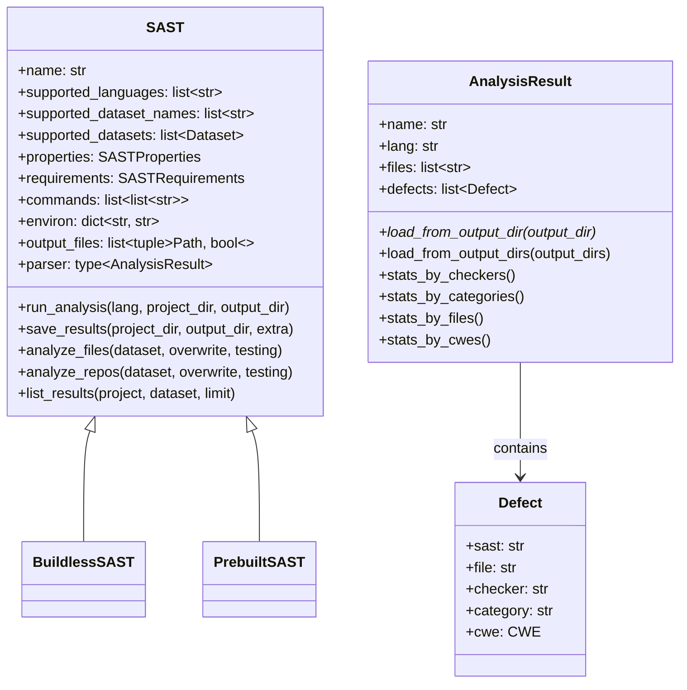

# SAST

**SAST (Static Application Security Testing)** is a methodology that involves using automated tools to find security vulnerabilities in software by analyzing its source code without executing it.

## Techniques

SAST tools use various techniques, including:

- `Pattern Matching`: Finds known-vulnerable code patterns. This technique does not require compilation.
- `Data Flow Analysis`:: Tracks data from sources to sinks to find security flaws. It is more accurate on compiled code but also works on source code.

The analysis process also depends on the programming language:

- `Interpreted languages`: SAST tools can often analyze the source code directly without a compilation step.
- `Compiled languages`: SAST tools often require the code to be compiled first. This allows the tool to resolve dependencies, understand classpaths, and build a more accurate model of the application for deeper analysis.

## Core Components

The framework provides a set of core abstract classes to standardize SAST integrations. The main components are `SAST`, `AnalysisResult`, and `Defect`.



## Integration

To integrate a new SAST into CodeSecTools, you need to create three main scripts:

- `sast.py`: Defines the SAST's metadata, such as its name, supported languages, properties, and requirements.
- `parser.py`: Contains the logic to parse the output files generated by the SAST tool and structure the findings.
- `cli.py`: Sets up the command-line interface for interacting with the SAST integration.

Once these scripts are added, the SAST is automatically integrated into the framework.

### Requirements
A SAST tool must meet the following requirements to be integrated:

- It must offer a **command-line interface (CLI) or an API** to trigger an analysis.
- The analysis results must include a **Common Weakness Enumeration (CWE) ID** for each identified vulnerability.

It is important to note that **CodeSecTools provides only the integration scripts, not the SAST tools themselves**.

Proprietary and private SAST tools can also be integrated. However, you must ensure that you provide all required licensing information.

When integrating a proprietary tool, **DO NOT commit any proprietary or private data** (such as license keys, binaries, or confidential source code) to the CodeSecTools repository, as this could violate licensing agreements.

Instead, store this data locally in `~/.codesectools/config/my_sast` and access it from your integration code using the following utility:
```python
from codesectools.utils import USER_CONFIG_DIR
my_private_file = USER_CONFIG_DIR / "my_sast" / "secrets.txt"
```

### Example

Please refer to existing SAST implementations for an example.
